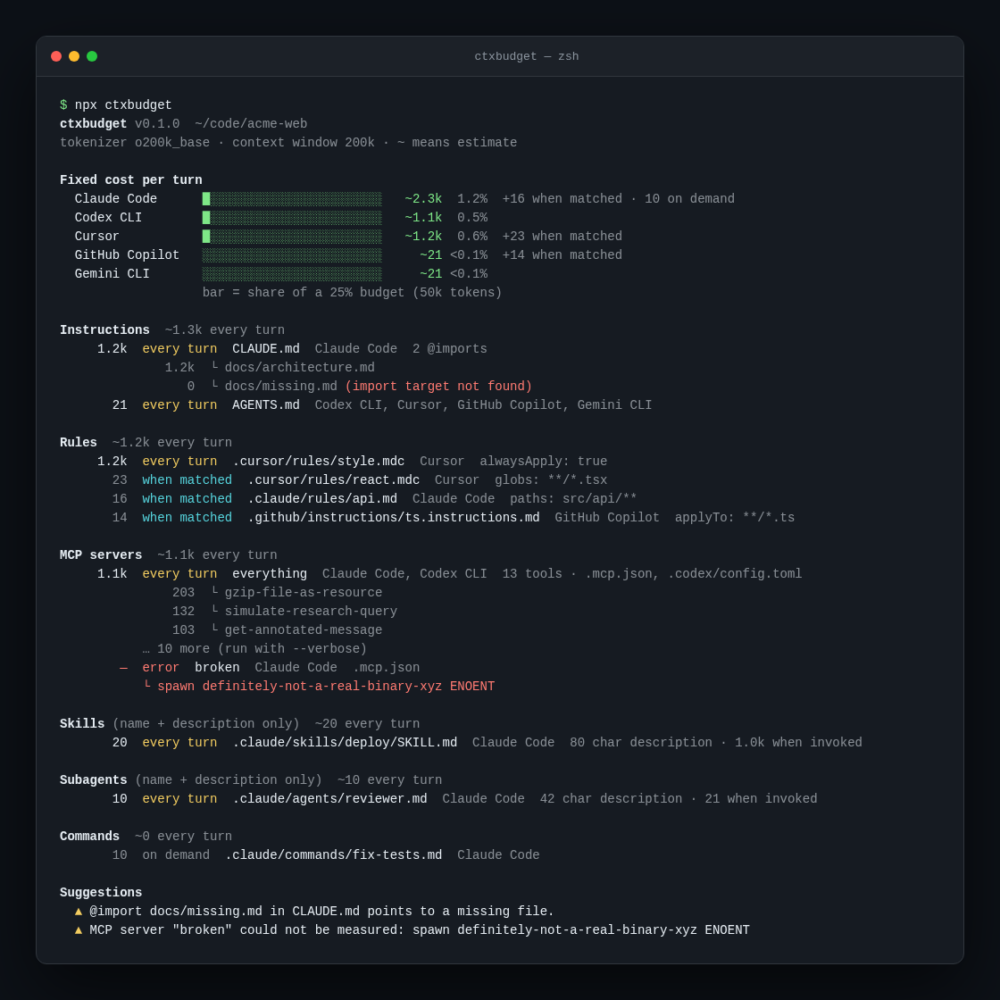

# ctxbudget

**How many tokens does your agent config cost on every turn?**

`ctxbudget` scans a repo the way Claude Code, Codex CLI, Cursor, GitHub Copilot and Gemini CLI do, and tells you exactly how much of the context window is spent before you type a single word: instruction files, `@imports`, always-on rules, skill and subagent listings, and — the big one — MCP tool schemas.



<details>
<summary>Text version of a report on a larger repo</summary>

```
$ npx ctxbudget

Fixed cost per turn
  Claude Code      ████████████░░░░░░░░░░░░  ~24.1k 12.1%  +1.6k when matched · 3.2k on demand
  Codex CLI        ██████████░░░░░░░░░░░░░░  ~21.4k 10.7%
  Cursor           ██░░░░░░░░░░░░░░░░░░░░░░   ~4.0k  2.0%  +2.3k when matched

MCP servers  ~20.3k every turn
    12.8k  every turn  github       Claude Code, Codex CLI  51 tools · .mcp.json, .codex/config.toml
             1.1k  ↳ create_pull_request_review
             ...
     7.5k  every turn  playwright   Claude Code             24 tools · .mcp.json

Suggestions
  ▲ MCP server "github" adds 12.8k tokens (51 tools) to every turn; the largest tool is
    "create_pull_request_review" at 1.1k. Disable it when not needed, or use an agent
    that supports tool search / deferred tool loading.
  ▲ CLAUDE.md is 3.4k tokens and loads every turn. Keep instruction files under ~3.0k …
```

</details>

## Why

Every MCP server you add ships its full tool list — names, descriptions, JSON schemas — into the prompt on every turn. Ten servers can quietly eat 40–60k tokens before your code even shows up. Instruction files, `@imports` and `alwaysApply` rules stack on top. Nobody shows you the bill.

`ctxbudget` does what the agents do (reads their config, actually connects to your MCP servers and calls `tools/list`) and counts tokens with the same tokenizer family OpenAI and Anthropic-compatible tooling uses, so the numbers are close to what you really pay.

## Install

```bash
npx ctxbudget            # zero-install
pnpm add -g ctxbudget    # or globally
```

Requires Node 20+.

## Usage

```bash
ctxbudget [dir]                  # full report
ctxbudget --agent claude -v      # one agent, every MCP tool expanded
ctxbudget --no-mcp               # don't start MCP servers (fast, files only)
ctxbudget --no-user              # ignore ~/.claude, ~/.codex, ~/.cursor, ~/.gemini
ctxbudget check --max 15000      # exit 1 if any agent exceeds the budget (CI)
ctxbudget json | jq .            # machine-readable report
```

### CI gate

```yaml
- run: npx ctxbudget check --max 20000 --no-mcp
```

## What it measures

| Agent | Instructions | Rules | Skills / subagents | Commands | MCP |
| --- | --- | --- | --- | --- | --- |
| Claude Code | `CLAUDE.md`, `.claude/CLAUDE.md`, `CLAUDE.local.md`, `~/.claude/CLAUDE.md`, `@imports` (depth 5) | `.claude/rules/*.md` (`paths:`) | `.claude/skills/*/SKILL.md`, `.claude/agents/*.md` | `.claude/commands` | `.mcp.json`, `~/.claude.json` |
| Codex CLI | `AGENTS.md`, `AGENTS.override.md`, `~/.codex/AGENTS.md` | – | `.codex/skills`, `.agents/skills` | `.codex/prompts` | `.codex/config.toml` |
| Cursor | `AGENTS.md`, `.cursorrules` | `.cursor/rules/*.mdc` (`alwaysApply` / `globs` / description) | `.cursor/skills`, `.agents/skills` | `.cursor/commands` | `.cursor/mcp.json` |
| GitHub Copilot | `.github/copilot-instructions.md`, `AGENTS.md` | `.github/instructions/*.instructions.md` (`applyTo`) | `.github/skills`, `.github/agents` | `.github/prompts` | `.vscode/mcp.json` |
| Gemini CLI | `GEMINI.md`, `~/.gemini/GEMINI.md` | – | `.gemini/skills` | `.gemini/commands` | `.gemini/settings.json` |

Loading modes:

- **every turn** — counted in the fixed cost (instruction files, always-on rules, skill/subagent *name + description*, MCP tool schemas)
- **when matched** — path-scoped rules (`paths:`, `globs:`, `applyTo:`); reported separately
- **on demand** — slash commands, skill bodies; free until used

Skills and subagents only pay for their frontmatter listing per turn; the report also shows the full size "when invoked".

MCP servers are started with your config's `command`/`args`/`env` (with `${VAR}` expansion) or connected over Streamable HTTP / SSE, then `tools/list` is paginated and each tool's `{name, description, inputSchema}` is tokenized. Servers declared in more than one agent's config are connected once and attributed to all of them.

## Accuracy

Token counts use `o200k_base` via [`gpt-tokenizer`](https://github.com/niieani/gpt-tokenizer). Anthropic and Google models tokenize slightly differently, and each agent wraps tools in its own template, so treat numbers as ±10% estimates. Relative sizes — *which* server or file dominates — are what matter, and those are exact.

## Programmatic use

```ts
import { scan } from "ctxbudget";

const report = await scan({ cwd: process.cwd(), mcp: false });
for (const a of report.agents) console.log(a.agent, a.always);
```

## Roadmap

Small, deliberate. Open an issue if one of these matters to you — it moves it up the list.

- [ ] More agents: Windsurf, Cline, Amp, Zed, Junie ([template issue](https://github.com/HumSaw/ctxbudget/issues/new?template=new-agent-or-location.yml))
- [ ] `ctxbudget diff` — compare against the last run or a git ref, print what grew
- [ ] Per-model tokenizers (Anthropic, Gemini) where a public tokenizer exists
- [ ] Measure MCP `resources/list` and `prompts/list`, not only tools
- [ ] GitHub Action with a PR comment ("this PR adds 2.3k tokens to every Claude Code turn")
- [ ] Watch mode for live editing of `CLAUDE.md` and rules

## Contributing

```bash
pnpm i
pnpm test
pnpm dev tests/fixtures/basic --no-user
```

PRs adding agents or config locations are welcome — each scanner is ~30 lines in `src/scan/`. See [CONTRIBUTING.md](CONTRIBUTING.md); security notes (it does start your MCP servers) are in [SECURITY.md](SECURITY.md).

## License

MIT
